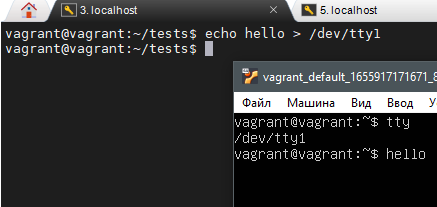

# Домашнее задание к занятию "3.2. Работа в терминале, лекция 2"

1. Какого типа команда `cd`? Попробуйте объяснить, почему она именно такого типа; опишите ход своих мыслей, если считаете что она могла бы быть другого типа.

    встроенная команда bash (при запуске нет нового процесса), меняет переменную окружения текущего шелла, отвечающию за текущий каталог - `PWD`

1. Какая альтернатива без pipe команде `grep <some_string> <some_file> | wc -l`? `man grep` поможет в ответе на этот вопрос. Ознакомьтесь с [документом](http://www.smallo.ruhr.de/award.html) о других подобных некорректных вариантах использования pipe.

    `grep -c <some_string> <some_file>`

1. Какой процесс с PID `1` является родителем для всех процессов в вашей виртуальной машине Ubuntu 20.04?

    `/sbin/init` - выполняет настройку окружения пользователя

1. Как будет выглядеть команда, которая перенаправит вывод stderr `ls` на другую сессию терминала?

    ```bash
    vagrant@vagrant:~$ ll /dev/pts/
    total 0
    drwxr-xr-x  2 root    root      0 Jun 26 12:55 ./
    drwxr-xr-x 19 root    root   3980 Jun 26 12:56 ../
    crw--w----  1 vagrant tty  136, 0 Jun 26 13:10 0
    crw--w----  1 vagrant tty  136, 1 Jun 26 13:08 1
    c---------  1 root    root   5, 2 Jun 26 12:55 ptmx
    vagrant@vagrant:~$ ls not_exists_file 2>/dev/pts/1
    ```

1. Получится ли одновременно передать команде файл на stdin и вывести ее stdout в другой файл? Приведите работающий пример.

    ```ls < some_file > ls_result```

1. Получится ли находясь в графическом режиме, вывести данные из PTY в какой-либо из эмуляторов TTY? Сможете ли вы наблюдать выводимые данные?

    

1. Выполните команду `bash 5>&1`. К чему она приведет? Что будет, если вы выполните `echo netology > /proc/$$/fd/5`? Почему так происходит?

    Создается новый 5 фд, вывод которого перенаправляется в stdout, на выходе получим вывод команды `echo`

1. Получится ли в качестве входного потока для pipe использовать только stderr команды, не потеряв при этом отображение stdout на pty? Напоминаем: по умолчанию через pipe передается только stdout команды слева от `|` на stdin команды справа.
Это можно сделать, поменяв стандартные потоки местами через промежуточный новый дескриптор, который вы научились создавать в предыдущем вопросе.

    ```bash
    vagrant@vagrant:~$ ls . not_exist  5>&1 1>&2 2>&5 | tee res
    .:
    ls: cannot access 'not_exist': No such file or directory
    res  tests
    vagrant@vagrant:~$ cat res
    ls: cannot access 'not_exist': No such file or directory
    ```

1. Что выведет команда `cat /proc/$$/environ`? Как еще можно получить аналогичный по содержанию вывод?

    Текущее окружение шелла

    ```bash
    cat /proc/self/environ
    env
    ```

1. Используя `man`, опишите что доступно по адресам `/proc/<PID>/cmdline`, `/proc/<PID>/exe`.

    `/proc/<PID>/cmdline` - файл содержит полную командную строку запуска процесса,
    `/proc/<PID>/exe` - ссылка на фактическое полное имя выполняемого файла

    ```bash
    ll /proc/$$/exe
    lrwxrwxrwx 1 vagrant vagrant 0 Jun 26 13:51 /proc/1688/exe -> /usr/bin/bash*
    cat /proc/$$/cmdline
    bash
    ```

1. Узнайте, какую наиболее старшую версию набора инструкций SSE поддерживает ваш процессор с помощью `/proc/cpuinfo`.

    `cat /proc/cpuinfo | grep sse`

1. При открытии нового окна терминала и `vagrant ssh` создается новая сессия и выделяется pty. Это можно подтвердить командой `tty`, которая упоминалась в лекции 3.2. Однако:

    ```bash
    vagrant@netology1:~$ ssh localhost 'tty'
    not a tty
    ```

    Почитайте, почему так происходит, и как изменить поведение.

    При таком вызове не создается терминал, можно так:

    ```ssh -t localhost 'tty'```

1. Бывает, что есть необходимость переместить запущенный процесс из одной сессии в другую. Попробуйте сделать это, воспользовавшись `reptyr`. Например, так можно перенести в `screen` процесс, который вы запустили по ошибке в обычной SSH-сессии.

    top запущен в соседнем терминале

    ```bash
    ps aux | grep top
    vagrant     1426  0.0  0.1   9408  4204 pts/1    S+   14:39   0:00 top
    vagrant     1428  0.0  0.0   6300   724 pts/0    S+   14:40   0:00 grep --color=auto top
    reptyr 1426
    ```

1. `sudo echo string > /root/new_file` не даст выполнить перенаправление под обычным пользователем, так как перенаправлением занимается процесс shell'а, который запущен без `sudo` под вашим пользователем. Для решения данной проблемы можно использовать конструкцию `echo string | sudo tee /root/new_file`. Узнайте что делает команда `tee` и почему в отличие от `sudo echo` команда с `sudo tee` будет работать.

    в первом случае мы запускаем команду echo под суперпользователем, что не даст нам писать в /root
    во-втором случае команду tee, которая читает из stdin
